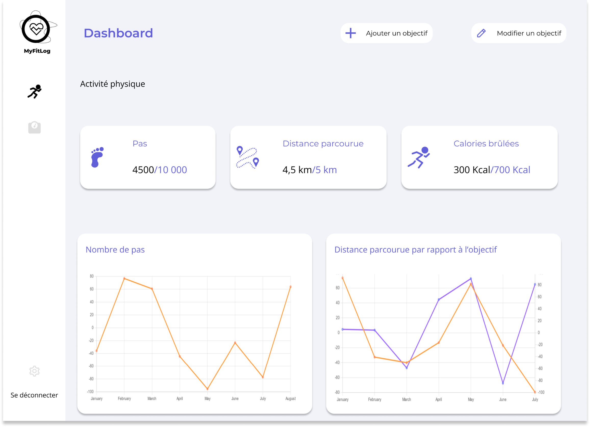

# MyFitLog


MyFitLog est une application de surveillance de la santé qui accompagne les utilisateurs dans leur parcours de bien-être et de condition physique. Nous avons créé cette application pour aider les utilisateurs à suivre leur santé et leur progression de manière simple et pratique. Voici quelques points de concept clés de notre application :  
  - **Suivi de l’activité physique** : l'application permet aux utilisateurs de suivre leur activité physique en enregistrant le nombre de pas, la distance parcourue, les calories brûlées et bien plus encore. Les graphiques et tableaux de l'application vous aideront à visualiser vos progrès et à atteindre vos objectifs de condition physique.

  - **Visualisation des données** : l'application comprend des graphiques et tableaux pour vous aider à visualiser vos progrès. Vous pouvez personnaliser les tableaux en fonction de vos préférences pour mieux suivre vos mesures. Avec MyFitLog, vous pouvez suivre votre santé et votre condition physique en un seul endroit.

  


---

## installer les dépendances
```bash
composer install
```

## setup webpack encore
```bash
pnpm install

pnpm encore dev-server
```

## setup vue
```bash
pnpm install
pnpm watch
```

## run app
```bash
symfony server:start # if you have symfony CLI
composer start # if you have PHP but no symfony CLI
```

## migrate schema in database
```bash
php bin/console doctrine:database:create  # create database in our system
php bin/console make:migration  # create a migration file
php bin/console doctrine:migrations:migrate  # apply migration in our database recently created
```

## load fixtures
```bash
php bin/console doctrine:fixtures:load
```

## encrypt data in database system
```bash
php bin/console encrypt:data
```

## assign room to a workshop
```bash
php bin/console assign-room
```


## Different roles allowed for users
* **ROLE_ADMIN**
* **ROLE_INTERVENANT**
* **ROLE_LYCEEN**


## Group members
1. _VOUVOU Brandon_
2. _KEITA Lansana_

**NB :** La modification et la suppression des utilisateurs n'est pas possible.
